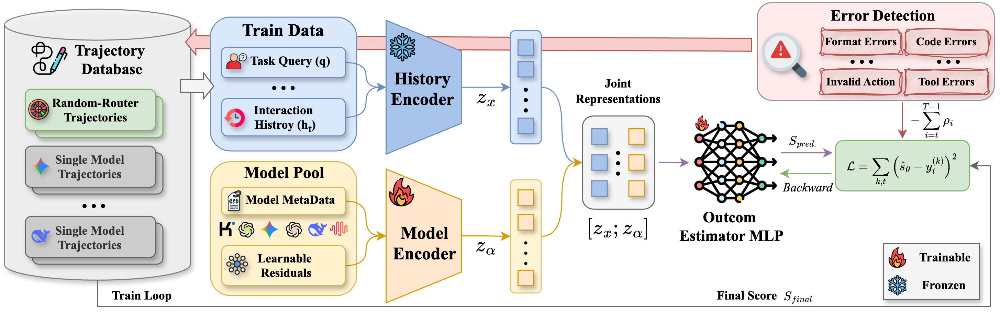
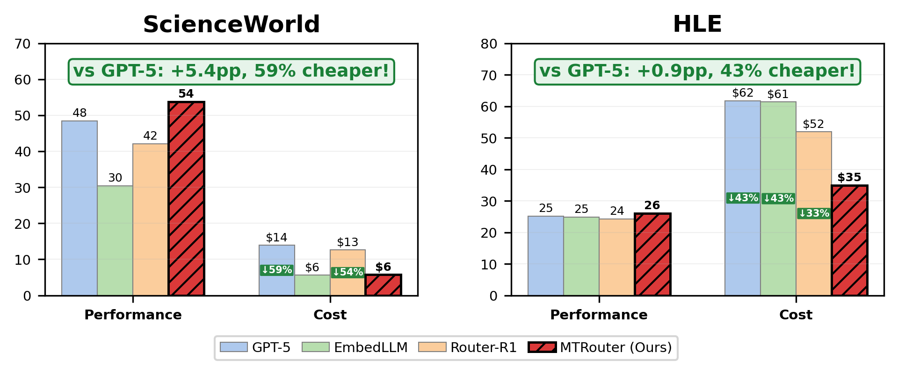
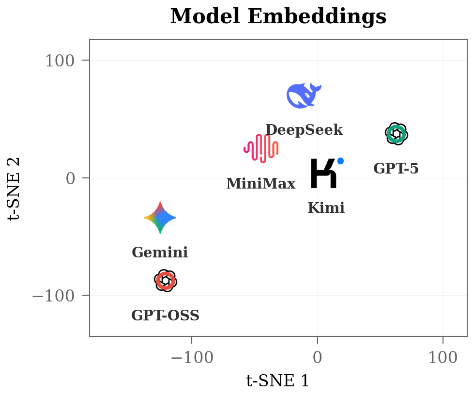

# MTRouter: Cost-Aware Multi-Turn LLM Routing with History-Model Joint Embeddings

> Official implementation of MTRouter, a cost-aware multi-turn LLM routing framework accepted to the ACL 2026 Main Conference.

> The Python import path remains `miniagenticrouter` for compatibility, while the preferred CLI aliases are `mtr` and `mtr-extra`.

## Method



## Results

### Main Results

#### ScienceWorld

| Method | Test Score ↑ | Test Cost ($) ↓ | OOD Score ↑ | OOD Cost ($) ↓ |
|:-------|:------------:|:---------------:|:-----------:|:--------------:|
| *Single-Model Baselines* |||||
| GPT-5 | 48.4 | 13.9 | 4.9 | 47.6 |
| DeepSeek-V3.2 | 13.1 | 2.9 | -4.2 | 22.8 |
| MiniMax-M2 | -0.5 | 3.2 | 0.9 | 10.9 |
| Kimi-K2 | 5.2 | 2.5 | 0.2 | 8.9 |
| Gemini-2.5-Flash-Lite | 4.2 | 0.3 | -2.1 | 1.5 |
| GPT-OSS-120B | 26.6 | 0.5 | 1.1 | 4.2 |
| *Single-Turn Routers* |||||
| RouterDC | 23.1 | 3.3 | 5.5 | 2.5 |
| EmbedLLM | 30.4 | 5.6 | 5.0 | 3.0 |
| AvengersPro | 36.8 | 4.1 | 2.4 | 4.1 |
| *Multi-Turn Routers* |||||
| Random Router | 21.7 | 3.9 | -8.1 | 20.3 |
| LLM Router | 19.8 | 12.2 | -0.4 | 28.3 |
| Router-R1 | 42.1 | 12.6 | 2.1 | 21.0 |
| OpenRouter† | -26.4 | 3.0 | -26.9 | 15.5 |
| **MTRouter (ours)** | **53.8** | 5.7 | **9.9** | 16.3 |
| ↳ *Δ vs GPT-5* | +5.4 | -58.7% | +5.0 | -65.8% |
| ↳ *Δ vs Router-R1* | +11.7 | -54.4% | +7.8 | -22.4% |

#### HLE (Humanity's Last Exam)

| Method | Test Acc ↑ | Test Cost ($) ↓ | OOD Acc ↑ | OOD Cost ($) ↓ |
|:-------|:----------:|:---------------:|:---------:|:--------------:|
| *Single-Model Baselines* |||||
| GPT-5 | 25.1 | 61.8 | 34.8 | 65.3 |
| DeepSeek-V3.2 | 15.6 | 22.4 | 28.7 | 22.2 |
| MiniMax-M2 | 7.8 | 18.1 | 8.9 | 9.8 |
| Kimi-K2 | 11.4 | 12.0 | 20.1 | 9.8 |
| Gemini-2.5-Flash-Lite | 5.6 | 3.0 | 8.4 | 2.1 |
| GPT-OSS-120B | 9.7 | 0.7 | 11.4 | 2.1 |
| *Single-Turn Routers* |||||
| RouterDC | 12.8 | 10.3 | 17.9 | 13.5 |
| EmbedLLM | 24.8 | 61.4 | 33.6 | 56.8 |
| AvengersPro | 23.7 | 47.5 | 30.6 | 33.3 |
| *Multi-Turn Routers* |||||
| Random Router | 20.0 | 16.9 | 23.8 | 14.7 |
| LLM Router | 24.0 | 56.2 | 36.0 | 35.6 |
| Router-R1 | 24.2 | 51.9 | 35.1 | 60.7 |
| OpenRouter† | 18.3 | 138.5 | 34.0 | 154.3 |
| **MTRouter (ours)** | **26.0** | 35.0 | **38.6** | 31.2 |
| ↳ *Δ vs GPT-5* | +0.9 | -43.4% | +3.8 | -52.3% |
| ↳ *Δ vs Router-R1* | +1.8 | -32.7% | +3.5 | -48.7% |

> **Note:** Total cost is summed over evaluated episodes. OOD evaluations use held-out task types (ScienceWorld) and held-out subject categories (HLE). †OpenRouter uses a fixed provider-side routing API with a different model pool.

### Router Performance Comparison



### Model Embeddings Visualization



## Features

- **Cost-Aware Routing**: Optimize model selection considering both performance and cost
- **History-Model Joint Embeddings**: Learn joint representations of conversation history and model characteristics
- **Multi-Turn Support**: Handle complex multi-turn interactions with state-dependent routing

## Supported Benchmarks

| Benchmark | Description | Action Mode |
|-----------|-------------|-------------|
| ScienceWorld | Text-based science simulation (30 task types, 6,700+ variations) | text |
| HLE (Humanity's Last Exam) | Multi-tool reasoning benchmark | multitool |

## Installation

```bash
# Basic installation
pip install -e .

# With ScienceWorld support
pip install -e ".[scienceworld]"

# With HLE support
pip install -e ".[hle]"

# Full installation
pip install -e ".[full]"
```

## Quick Start

### ScienceWorld Evaluation

[ScienceWorld](https://github.com/allenai/ScienceWorld) is a text-based science simulation environment for evaluating scientific reasoning.

**Installation:**

```bash
# Install with ScienceWorld support (requires Java runtime)
pip install -e ".[scienceworld]"

# Install Java if not available
sudo apt-get install default-jre  # Ubuntu/Debian
```

**Usage:**

```bash
# Run a single task
mtr-extra scienceworld-single boil --variation 0 -m anthropic/claude-sonnet-4-5-20250929

# Batch evaluation
mtr-extra scienceworld \
    --task "boil*" \
    --workers 4 \
    --model anthropic/claude-sonnet-4-5-20250929 \
    -o ./scienceworld_results
```

**With Router:**

```bash
# With learned router
mtr-extra scienceworld \
    --task "boil*" \
    -r learned \
    -m "openai/gpt-4o,anthropic/claude-sonnet-4-5-20250929" \
    -o ./results
```

### HLE Evaluation

The multi-tool architecture supports structured tool calls for HLE benchmark.

**Built-in Tools:**

| Tool | Description |
|------|-------------|
| `search` | Web search via Serper API |
| `python` | Python code execution |
| `browse` | Fetch web page content |
| `bash` | Shell command execution |
| `answer` | Submit final answer |

**Usage:**

```python
from miniagenticrouter.agents.multitool import MultiToolAgent
from miniagenticrouter.models import get_model

agent = MultiToolAgent(
    model=get_model("anthropic/claude-sonnet-4-5-20250929"),
    enabled_tools=["search", "python", "browse", "answer"],
)

exit_status, result = agent.run("What is 2^100? Calculate it.")
```

## Configuration

### Environment Variables

| Variable | Description |
|----------|-------------|
| `ANTHROPIC_API_KEY` | Anthropic API key |
| `OPENAI_API_KEY` | OpenAI API key |
| `SERPER_API_KEY` | Serper API key for web search |

## License

MIT License - see [LICENSE.md](LICENSE.md)
